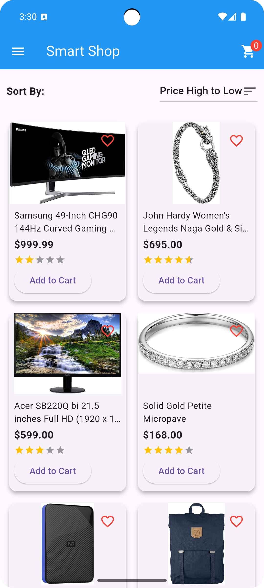
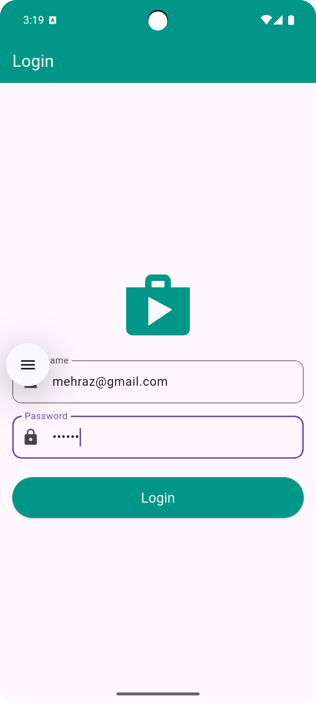
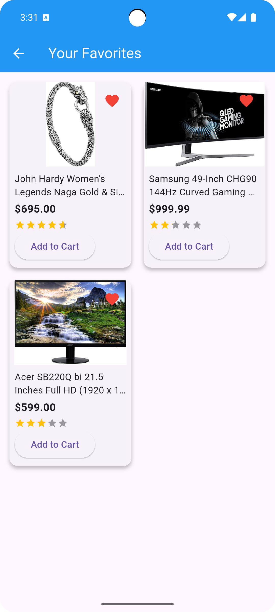
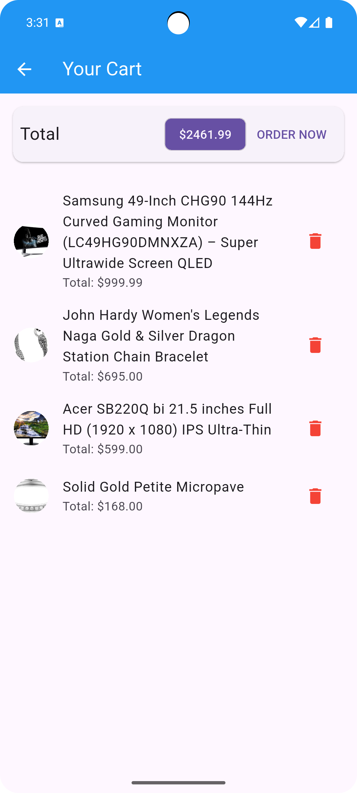
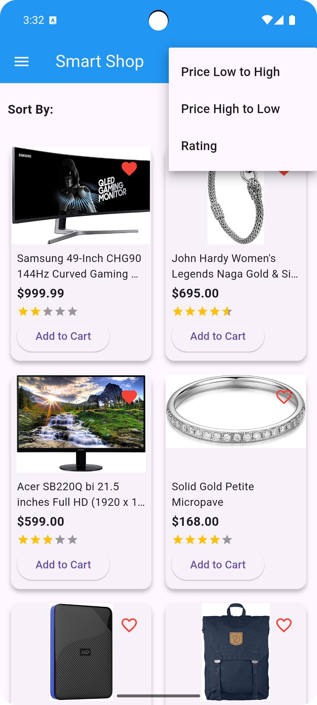
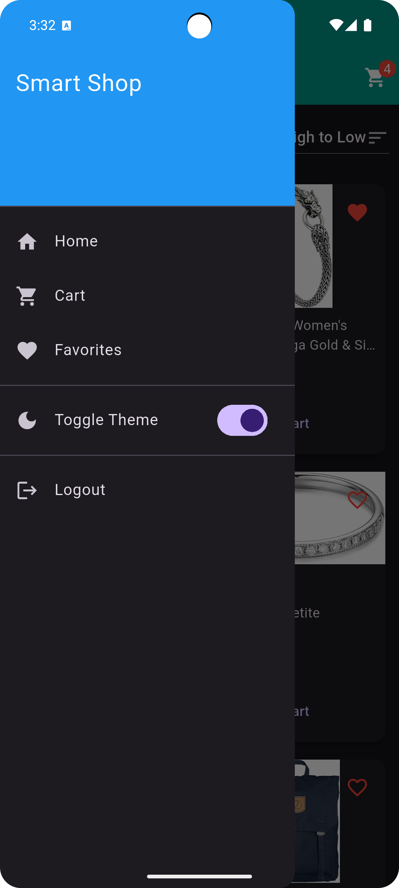

# Smart Shop - Flutter E-Commerce App

## Description

The **Smart Shop** is a mini e-commerce app built using **Flutter**, which incorporates various concepts like **Provider** for state management, **SharedPreferences** for persistence, **Theme toggling** (dark/light), **Navigation & routing**, and a **Basic RESTful API** using **FakeStore API**.

This app allows users to browse products, add them to the cart, mark them as favorites, and manage their theme preferences. The app is built with an emphasis on usability and a clean design.

---

## Features

### 1. **Login/Register Screen**
- Simple login screen with **TextFormField** for username and password.
- **Validation** for input fields.
- Store login status using **SharedPreferences**.
- Navigate to home screen after successful login.

### 2. **Home Page**
- Fetches a list of products using the **FakeStore API**.
- Display each product with **name, price, description, and rating**.
- Allows users to **add/remove items to the cart**.
- Users can **favorite** a product and view them on a separate page.
- **Sorting** functionality for:
  - Price: Low → High, High → Low
  - Rating: High → Low
- **RefreshIndicator** to reload the product list by pulling down.

### 3. **Cart Page**
- Displays items added to the cart, showing the **total price** and **ratings**.
- Allows users to **remove items from the cart**.

### 4. **Theme Switch**
- Option to switch between **Dark/Light Themes**.
- Saves user preference using **SharedPreferences**.

### 5. **Drawer Navigation**
- Includes routes to:
  - **Home**
  - **Cart**
  - **Favorites**
  - **Profile** (Optional)
  - **Logout**

### 6. **Logout**
- Clears login data from **SharedPreferences** and navigates back to the login screen.

---

## Screenshots

### Home Screen
<p align="center">
  
  <span>Home Screen</span>
</p>

### Login Page
<p align="center">
  
  <span>Login Page</span>
</p>

### Favorites Page
<p align="center">
  
  <span>Favorites Page</span>
</p>

### Cart Page
<p align="center">
  
  <span>Cart Page</span>
</p>

### Sorting: Price High to Low
<p align="center">
  
  <span>Sorting: Price High to Low</span>
</p>

### Dark Theme
<p align="center">
  
  <span>Dark Theme</span>
</p>


## Installation

### 1. Clone the repository

```bash
git clone https://github.com/itz-mehraz/SmartShop-Flutter.git

## Installation

### 1. Clone the repository

```bash
git clone https://github.com/itz-mehraz/SmartShop-Flutter.git


## Installation

### 1. Clone the repository

```bash
git clone https://github.com/itz-mehraz/SmartShop-Flutter.git

## Installation

### 1. Clone the repository

```bash
git clone https://github.com/itz-mehraz/SmartShop-Flutter.git


### 2. Change the directory

```bash
cd SmartShop-Flutter
```

### 3. Install dependencies

```bash
flutter pub get
```

### 4. Run the app

To run the app on an Android emulator or device, use the following command:

```bash
flutter run
```

---

## Technologies Used

* **Flutter**: A framework for building natively compiled applications.
* **Provider**: For state management.
* **SharedPreferences**: For storing app preferences and login data.
* **FakeStore API**: A simple API for product data.
* **Dart**: Programming language used for app development.

---

## Folder Structure

```plaintext
lib/
├── main.dart                  # Entry point of the app
├── models/
│   └── product_model.dart     # Product model
├── providers/
│   ├── auth_provider.dart     # Auth logic for login/logout
│   ├── cart_provider.dart     # Cart management
│   ├── favorites_provider.dart # Favorite products management
│   ├── product_provider.dart  # Fetching and managing products
│   └── theme_provider.dart    # Theme management (dark/light)
├── screens/
│   ├── auth/
│   │   └── login_screen.dart  # Login screen
│   ├── cart/
│   │   └── cart_screen.dart   # Cart page
│   ├── favorites/
│   │   └── favorites_screen.dart # Favorites page
│   ├── home/
│   │   └── home_screen.dart   # Home page
│   └── splash_screen.dart     # Splash screen
├── services/
│   └── api_service.dart       # API service for fetching data
├── utils/
│   ├── app_routes.dart        # Route management
│   └── app_theme.dart         # Theme configuration
├── widgets/
│   ├── app_drawer.dart        # Drawer widget
│   └── product_card.dart      # Product display widget
assets/
├── Homepage.png               # Screenshot of Home Page
├── Dark_Theme.png             # Screenshot of Dark Theme
├── Favorites_Page.png         # Screenshot of Favorites Page
├── Cart_Page.png              # Screenshot of Cart Page
├── Sorting_Price_high_Low.png # Screenshot of Sorting (Price High to Low)
├── login_page.png             # Screenshot of Login Page
```

---

## Contributing

1. Fork the repository.
2. Create your branch (`git checkout -b feature-name`).
3. Commit your changes (`git commit -m 'Add new feature'`).
4. Push to the branch (`git push origin feature-name`).
5. Create a new Pull Request.

---

## License

This project is open-source and available under the [MIT License](LICENSE).

````

### What to Do Next:
1. **Images**: Ensure that the images (e.g., `Homepage.png`, `login_page.png`, etc.) are placed in the `assets/` folder in your project. The images should be properly linked for the markdown to show them in the GitHub repository.
   
2. **Commit the changes**:
   Once you have updated the README.md with correct image paths, commit the changes and push them to GitHub:

   ```bash
   git add README.md
   git commit -m "Update README with correct image paths"
   git push origin main
````

This will make sure the images display properly on GitHub's README page.
